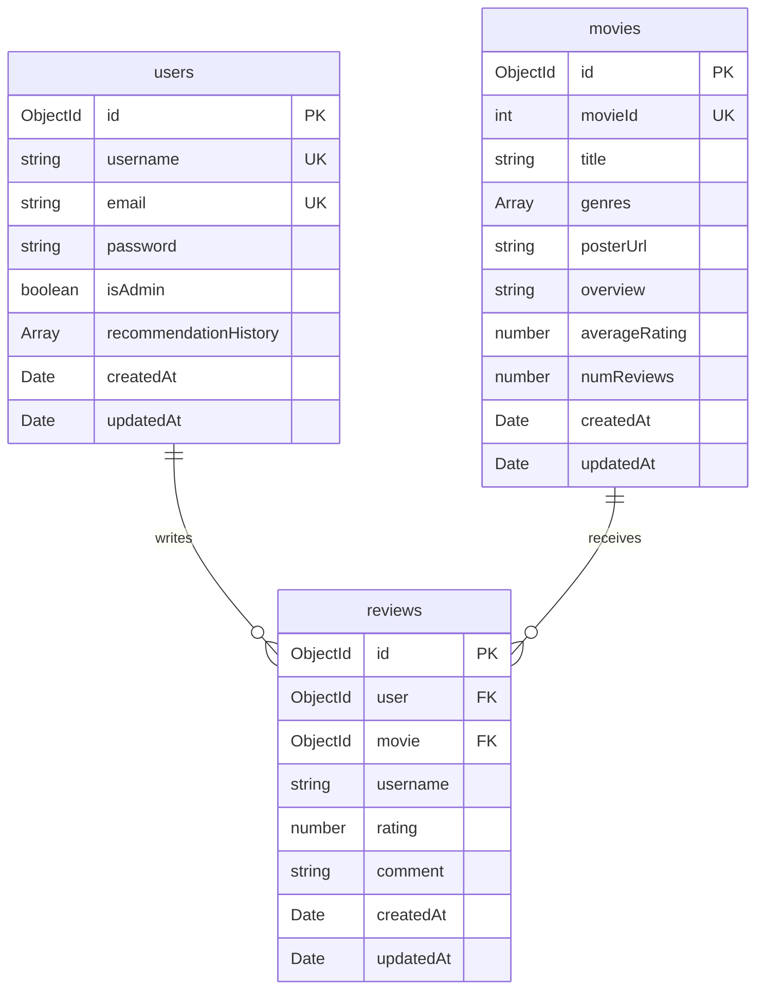

# CineMatch AI — Unified Movie Recommendation Ecosystem

<div align="center">

[](https://github.com/AnishaPaturi/movie-recommendation-platform/stargazers)
[](https://github.com/AnishaPaturi/movie-recommendation-platform/network/members)
[](https://github.com/AnishaPaturi/movie-recommendation-platform/issues)
[](https://github.com/AnishaPaturi/movie-recommendation-platform/pulls)

</div>

<div align="center">

[](https://www.python.org/)
[](https://fastapi.tiangolo.com/)
[](https://nodejs.org/)
[](https://expressjs.com/)
[](https://react.dev/)
[](https://reactnative.dev/)
[](https://www.mongodb.com/)
[](https://www.docker.com/)

</div>

CineMatch AI is a unified, intelligent movie recommendation and discovery ecosystem. Instead of relying on generic listings, the platform integrates a Python-based content similarity engine (TF-IDF & Cosine Similarity) with a modern Node.js/Express backend API gateway, a rich React web dashboard, and a mobile Expo-powered React Native client application.

The platform includes debounced autocomplete suggestions, local browser-cached query histories, a dynamic "Surprise Me" selector, and intelligent poster lazy-loading that queries IMDb APIs in real-time to backfill missing movie images inside a local MongoDB database.

---

## 🏗️ System Architecture

The ecosystem relies on a decoupled, microservices-driven design: a containerized MongoDB instance, a Python/FastAPI ML node driving content similarity logic, a Node.js Express API service managing collections/metadata/caching, and dual client applications (React & Expo).

```mermaid
graph TD
    subgraph Client Applications
        Web["React Web App (Port 3000)"]
        Mobile["React Native Expo App (Port 8081)"]
    end

    subgraph Backend Services (Docker Compose)
        API["Node.js Express Backend (Port 5000)"]
        ML["Python FastAPI Engine (Port 8000)"]
        DB[(MongoDB Container: movie-db)]
    end

    Web -->|API Requests| API
    Mobile -->|API Requests| API
    API -->|Connects & Queries| DB
    API -->|Sends Similarity Query| ML
    API -.->|Lazy-loads Posters| IMDB[FM-DB IMDb Search API]
```

---

## 🛠️ Technology Stack

| Layer | Technology | Key Capabilities |
| :--- | :--- | :--- |
| **Web Frontend** | React, React Router, Vanilla CSS | Live debounced autocomplete, modern dark mode interfaces, local history |
| **Mobile Frontend**| React Native (Expo), React Navigation | Cross-platform compatibility, flat list renderings, custom gesture hooks |
| **API Gateway Backend**| Node.js, Express.js, Axios | Routing, external poster lazy-loading, database interaction middleware |
| **Database** | MongoDB (Mongoose) | Scalable document data, custom text indexation for fast queries |
| **ML Engine Core** | Python FastAPI, Uvicorn | High-performance asynchronous API endpoints for model interactions |
| **Mathematical Models**| Pandas, Numpy, Scikit-learn (TF-IDF) | Text tokenization, vector spacing, cosine similarity scoring |
| **Containerization** | Docker, Docker Compose | Consistent environments across MongoDB, ML service, and the Backend |

---

## 📂 Database Design

The relational document schemas are managed inside MongoDB. The application features automatic index setup on backend initialization.

### 📐 Entity-Relationship (ER) Diagram



### 🗄️ Document Schema Layout

#### 🔑 Core Accounts & Histories
* **`users`**: Stored under [User.js](file:///C:/Users/anish/OneDrive/College/Projects/movie-recommendation-platform/backend/src/models/User.js). Tracks authentication credentials (email, username, hashed passwords) and an array of search histories (query title, recommended titles, and timestamps) for historical tracking.

#### 🎬 Media Metadata & Community
* **`movies`**: Stored under [Movie.js](file:///C:/Users/anish/OneDrive/College/Projects/movie-recommendation-platform/backend/src/models/Movie.js). Tracks IDs, pipe-split genres, overview descriptions, pre-calculated rating weights, and dynamically cached IMDb poster URLs.
* **`reviews`**: Stored under [Review.js](file:///C:/Users/anish/OneDrive/College/Projects/movie-recommendation-platform/backend/src/models/Review.js). Holds individual ratings (scale of 0.5 to 5.0) and reviews mapped uniquely per user per movie.

---

## 🌟 Core Modules & Features

### 1. TF-IDF ML Recommendation Engine
The core similarity machine that parses MovieLens titles, genres, and metadata to return recommendations.

**Stack:** `Python FastAPI` `Scikit-Learn` `Pandas` `Numpy` `Joblib`

* **Content-Based Vector Space**: Uses TF-IDF (Term Frequency-Inverse Document Frequency) vectorizers to translate genres and contextual keywords into multi-dimensional coordinates.
* **Cosine Similarity calculations**: Computes proximity angles between movies in real-time inside [recommendation_engine.py](file:///C:/Users/anish/OneDrive/College/Projects/movie-recommendation-platform/ml-service/src/recommendation_engine.py) to propose matching items.
* **Uvicorn Gateway**: Implemented inside [main.py](file:///C:/Users/anish/OneDrive/College/Projects/movie-recommendation-platform/ml-service/api/main.py) to parse query parameters and return recommendations over rapid REST responses.

---

### 2. Express.js API & Intelligent Data Loader
A high-throughput API gateway connecting MongoDB records with the Python similarity engine and third-party IMDb services.

**Stack:** `Node.js` `Express.js` `Mongoose` `Axios`

* **IMDb Poster Lazy-Loader**: When recommended titles do not contain pre-cached posters, the backend dynamically calls the external FM-DB IMDb API, extracts the `#IMG_POSTER` link, and writes it to MongoDB in [recommendationController.js](file:///C:/Users/anish/OneDrive/College/Projects/movie-recommendation-platform/backend/src/controllers/recommendationController.js) for persistent, fast serving on subsequent queries.
* **Flexible Seeding Tool**: Integrates a robust CSV parser in [seedDatabase.js](file:///C:/Users/anish/OneDrive/College/Projects/movie-recommendation-platform/backend/src/scripts/seedDatabase.js) that reads large MovieLens raw CSV structures, cleans quotes/special characters, groups genres, and bulk-imports entries into MongoDB.

---

### 3. Dynamic Web Studio
A polished React single-page application focused on aesthetic presentation, responsiveness, and easy navigation.

**Stack:** `React` `React Router` `Axios` `LocalStorage API`

* **Autocomplete Search Box**: Shows real-time matching suggestions with thumbnail posters as the user types, powered by a debounced hook.
* **Surprise Me**: Utilizes a randomized database retrieval algorithm to propose random movies and recommendations.
* **Client-Side History**: Stores up to 20 past search queries and results directly in the browser's local storage inside [Recommendations.jsx](file:///C:/Users/anish/OneDrive/College/Projects/movie-recommendation-platform/frontend-web/src/pages/Recommendations.jsx), removing unnecessary backend authentication latency.
* **SPA Routing Rules**: Configured rewrite rules in [vercel.json](file:///C:/Users/anish/OneDrive/College/Projects/movie-recommendation-platform/frontend-web/vercel.json) and [public/_redirects](file:///C:/Users/anish/OneDrive/College/Projects/movie-recommendation-platform/frontend-web/public/_redirects) to support client-side routing on production hosting platforms without generating 404 errors.

---

### 4. Expo Mobile Client
A TypeScript React Native app optimized for testing recommenders on real-world cellular devices.

**Stack:** `React Native` `Expo Router` `Axios`

* **Compact Search Layout**: Offers clean mobile-optimized views in [index.tsx](file:///C:/Users/anish/OneDrive/College/Projects/movie-recommendation-platform/mobile-app/app/(tabs)/index.tsx).
* **Network Integration**: Communicates with the local network-exposed gateway server to return recommendations directly on physical hardware.

---

## 🚀 Local Installation & Setup

Ensure your machine matches the dependencies listed below before proceeding.

### 📋 Prerequisites & Verification

| Dependency | Required Version | Verification Command | Purpose |
| :--- | :--- | :--- | :--- |
| **Node.js** | v18+ | `node -v` | Backend runtime & Web/Mobile tooling |
| **Python** | 3.9+ | `python --version` | Fast-API Machine Learning script engine |
| **Docker Engine**| 20.10+ | `docker --version` | Multipass local container environment |
| **MongoDB** | 6.0+ (Or Container) | `mongo --version` | Database storing media details |

---

### 🐳 Step 1: Spin Up Infrastructure Services (Docker)
1. Ensure Docker Desktop is active.
2. Navigate to the docker orchestrator folder:
   ```bash
   cd docker
   ```
3. Run the compose environment:
   ```bash
   docker compose up -d
   ```
4. Verify that the 3 containers (`movie-db`, `movie-ml`, and `movie-backend`) are healthy:
   ```bash
   docker ps
   ```

#### 🖥️ Port Configurations

| Service | Host Port | Web API Endpoint | Platform Function |
| :--- | :--- | :--- | :--- |
| **FastAPI ML Service**| `8000` | [http://localhost:8000/docs](http://localhost:8000/docs) | Generates movie recommendations |
| **Express Backend** | `5000` | [http://localhost:5000/health](http://localhost:5000/health) | API Gateway & DB Router |
| **MongoDB Database**| `27017` | `mongodb://localhost:27017` | Relational document store |

---

### 🗄️ Step 2: Seed the Database
Before querying recommendations, seed the movie catalog:

1. Open a terminal and enter the backend workspace:
   ```bash
   cd backend
   ```
2. Install dependencies:
   ```bash
   npm install
   ```
3. Run the database seed script:
   ```bash
   npm run seed
   ```

---

### 🐍 Step 3: Run Python AI Services (Alternative to Docker)
If you prefer running the ML engine directly on your local system:

1. Navigate to the ML project folder:
   ```bash
   cd ml-service
   ```
2. Set up and activate a virtual environment:
   ```bash
   python -m venv venv
   # Windows:
   venv\Scripts\Activate.ps1
   # macOS/Linux:
   source venv/bin/activate
   ```
3. Install the dependencies:
   ```bash
   pip install -r requirements.txt
   ```
4. Run the FastAPI development server:
   ```bash
   uvicorn api.main:app --port 8000 --reload
   ```

---

### 💻 Step 4: Run the React Web App
1. Go to the web application folder:
   ```bash
   cd frontend-web
   ```
2. Install the node modules:
   ```bash
   npm install
   ```
3. Boot up the local react server:
   ```bash
   npm start
   ```
4. Open your web browser to [http://localhost:3000](http://localhost:3000).

---

### 📱 Step 5: Run the Expo Mobile App
1. Go to the mobile application folder:
   ```bash
   cd mobile-app
   ```
2. Install dependencies:
   ```bash
   npm install
   ```
3. Boot up the Expo dev server:
   ```bash
   npx expo start
   ```
4. Scan the QR code using your **Expo Go** application.

---

## ☁️ Production Cloud Deployment

### 1. Frontend Configuration
Configure the following variable in your cloud provider's dashboard (e.g. Vercel or Netlify):
* **Key**: `REACT_APP_API_URL`
* **Value**: *[Your Deployed Backend API Link]* (e.g. `https://api.yourdomain.com/api`)

### 2. Client-Side Routing Support
The repository includes routing rewrite configurations to prevent 404 errors on refreshes:
* **Vercel**: Configured in [vercel.json](file:///C:/Users/anish/OneDrive/College/Projects/movie-recommendation-platform/frontend-web/vercel.json)
* **Netlify**: Configured in [public/_redirects](file:///C:/Users/anish/OneDrive/College/Projects/movie-recommendation-platform/frontend-web/public/_redirects)

---

## 👥 About the Author

* **Author Name**: Anisha Paturi
* **Role**: Primary System Architect & Full-Stack Developer

Anisha Paturi is a computer science undergraduate passionate about full-stack engineering, cloud services, and AI agent integration. CineMatch AI is a platform designed to demonstrate modern machine learning recommendation algorithms integrated into a full-scale web and mobile ecosystem.